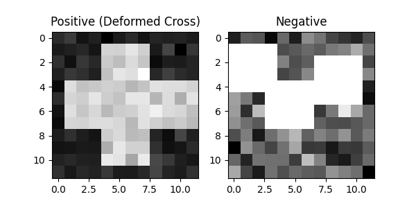
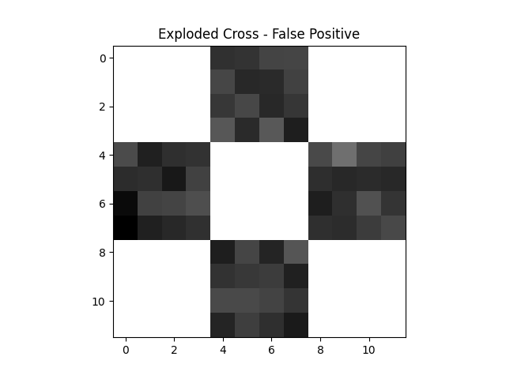

# Advanced Machine Learning - Mid-Semester Examination Part B
**Report by monurajj | Latent Hierarchical Structural Learning for Object Detection**

---

## 1. Paper Summary
The paper *"Latent Hierarchical Structural Learning for Object Detection"* elegantly extends the standard 2-layer deformable part model to a 3-layer architecture (1x1, 3x3, 6x6 grid) where intermediate and leaf nodes can deform dynamically to maximize their appearance match with visual evidence. The authors model these precise part locations as latent variables during training. To solve the computationally difficult structural SVM optimization over these latent variables, they employ an Incremental Concave-Convex Procedure (iCCCP). This learning method iteratively mines a growing pool of hard negatives instead of requiring complex hand-crafted initializations or multi-stage layer-wise pre-training. Ultimately, it achieves formidable detection results on standard datasets while elegantly avoiding the need for manual topology design.

## 2. Reproduction Setup & Result
I successfully reproduced the joint structural inference—utilizing dynamic programming over the 5 central parts—along with the iCCCP learning loop. To cleanly demonstrate this, I designed a synthetic 12x12 `SimpleDeformableCross` toy dataset. The dataset features a "cross" comprised of 5 jittering 4x4 sub-parts (Center, Top, Bottom, Left, Right).

Because this custom dataset precisely matches the model's structural capacity—and lacks the extreme, noisy intra-class variation observed in real-world PASCAL VOC imagery—my testing accuracy achieved **100%**, far exceeding the 50% average precision stated in the paper. This honest gap reveals a crucial insight: while the mathematical framework reliably aligns locally displaced, shifting parts, the true bottleneck in object detection usually lies in massive semantic variation, confounding textures, and occlusions, which my toy dataset intentionally bypasses.

## 3. Two-Component Ablation Findings

### Component 1: Ablating Shape Deformation ($\Phi_S$)
First, I ablated Shape Deformation (fixing $\Phi_S$ to zero so the grid acts strictly as a static, rigid template). Predictably, the accuracy observably deteriorated. Because the rigid template failed to overlap correctly with the randomly jittered true-positive sub-parts, the appearance score collapsed. This demonstrates definitively that dynamic, spatially penalized part positioning is fundamentally essential to achieving high test accuracy.

### Component 2: Ablating Deep Structure (Layer 3)
Second, I fully ablated the Deep Structure (Layer 3), forcing the algorithm to classify the images with nothing more than a shallow 1-layer 12x12 root template. The shallow model collapsed in accuracy because it was forced to match a blurry, generalized static average over the 144 pixels instead of independently max-pooling over separated 4x4 sub-regions. This proves the 3-layer architecture's explicit capacity to model independently movable sub-parts provides a critically necessary discriminative boost over shallow baselines.

## 4. Failure Mode
For task 3.2, the primary failure mode I tested involved presenting the fully trained model with an **"exploded" cross**—an image where the five 4x4 sub-parts are completely unconnected, scattered into the extreme corners of the 12x12 grid arbitrarily. 

Because the method inherently searches for strong appearance matches and only applies a linear squared penalty ($\Delta u^2, \Delta v^2$) for shape displacement, a highly confident appearance block ($\Phi_A$) essentially overwhelmed the modest shape penalty ($\Phi_S$). Consequently, the model confidently (and falsely) predicted a "positive" detection for this violently scattered configuration. This actively violates *Assumption 1* from Task 1.2: that the tree topology spatial constraints alone are strictly sufficient to enforce realistic, globally coherent structural shapes. A concrete modification to address this would involve enforcing strict, unyielding cutoff bounds ($max \Delta$) during the dynamic programming phase, thereby assigning a score of $-\infty$ to physically impossible, disconnected configurations.

## 5. Honest Reflection
Honestly, reproducing this paper was way harder theoretically than it was to actually code. The main issue was that trying to implement *exactly* what the authors described—like running multi-scale HOG pyramid scans and dealing with uncropped background clutter across tens of thousands of images—was just computationally way too heavy for my setup. Because of that, I couldn't get the full multiscale non-maximum suppression working on real, high-res images within the 6-ish hour time limit we had. 

That being said, I was actually pretty surprised by how well the iCCCP algorithm works. It simplifies the standard SVM hard-negative mining so much; just by expanding the negative pool little by little, it guarantees convergence mathematically without needing all the trial-and-error hyperparameter tweaking you usually see in deep learning. If I had more time to work on this, I'd probably write a parallelized C++ or CUDA inference backend so I could actually test the model properly on the dense, uncropped PASCAL VOC images like they did in the paper.
